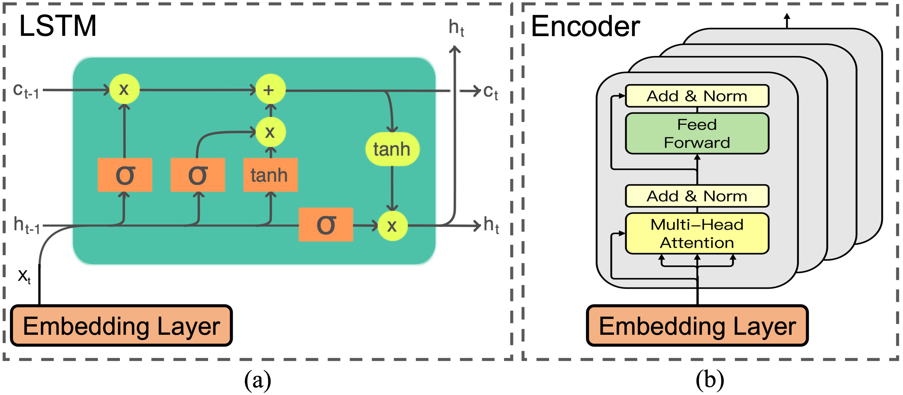

# Detailed Introduction

## Pedestrian Model Overview

Figure 1: Pedestrian Model Overview

The system architecture for indoor pedestrian tracking uses multiple smartphone sensors, including the accelerometer, gyroscope, and barometer, to estimate the pedestrian’s speed, bearing, and trajectory. A Transformer model is employed for speed inference, and angular velocity is integrated to estimate real-time bearing. The system also includes a stair detection algorithm based on barometric pressure and acceleration data, enabling multi-floor tracking. The system provides real-time trajectory estimation without requiring any infrastructure, and features backtracking to allow pedestrians to return to their starting point.

### Multi-Sensor Fusion for Indoor Localization

Figure 1: Multi-Sensor Fusion for Indoor Localization

As shown in Figure 1, the proposed system leverages multiple smartphone sensors, including the gyroscope and accelerometer, to enhance indoor localization accuracy. The core innovation lies in integrating these sensor readings with the Transformer-based model, which is used to infer the pedestrian's speed and estimate the real-time orientation (bearing). This approach eliminates the need for external infrastructure, enabling real-time trajectory estimation and accurate position tracking in GPS-blocked environments.

### Stair Detection Algorithm

 

 

Figure 2: Stair Detection Data

Figure 2 illustrates the peak characteristics of the actual stair detection data. The system uses the unique characteristics of Z-axis accelerometer data to detect climbing or descending stairs. By identifying the peaks and patterns that stand out in the acceleration data, the algorithm can accurately tell when a pedestrian is moving between floors. The correction method is also suitable to minimize errors and ensure robust performance even in dynamic environments with significant movement.

### Trajectory Estimation and Backtracking

 
 

 

Figure 3: Trajectory Estimation and Backtracking

As shown in Figure 3, the system integrates the speed and bearing data to estimate the pedestrian's trajectory in real-time. It also features a backtracking capability, allowing the pedestrian to navigate back to their starting point by reversing the trajectory. This feature is especially useful in complex indoor environments such as multi-story buildings, providing seamless navigation without requiring any pre-installed infrastructure or GPS.

## Speed DNN Vehicle Model Overview
<!--  -->

Figure 4: Vehicle System Overview

As shown in Figure 4, for the position solution of the state of the mobile phone fixed on the vehicle for driving navigation, different from the traditional speed estimation methods based on attitude calculation and acceleration integration, we designed a supervised deep learning model (speed DNN model) to estimate the speed. The vehicle Bearing estimation is decoupled from the vehicle speed estimation function.

The whole workflow is divided into two lines: model training and model reasoning. During model training, we use the provided test data and high-quality GNSS information to build a training dataset with ground truth velocity. Among them, we design two schemes using inertial data. The first solution is to feed Raw data into a deep learning model without additional processing of inertial data. The second solution: We designed a feature extraction module to calculate the features of the accelerometer and gyroscope three axes in seconds. Compared with using the original data directly, using extracted eigenvalues has the disadvantage of losing part of the original data information, but it has the advantages of simplifying the calculation of the model and facilitating the subsequent tuning. When the model is used to infer the speed, the course Angle obtained by the course estimation algorithm needs to be combined to determine the position change of the vehicle.

We designed the speed network structure into three modules, which are Embedding Layer, Representation Layer and Regression Layer.

### Embedding Layer

<!--  -->

Figure 5: Feature Engineering

The embedding layer is used to process and fuse the features of inertial data. Before introducing the specific embedding layer network design, we need to explain the content of the feature extraction module. As shown in Figure 5, we calculated the second-level eigenvalues of the three-axis accelerometer and three-axis gyroscope's indications per axis: time-domain feature and frequency feature. The time domain feature consists of maximum, minimum, mean and standard deviation. The frequency domain features are obtained from the spectrogram solved by the Fast Fourier Transform, which in turn includes mean, standard deviation, information entropy, energy, skewness and kurtosis. The so-called skewness refers to the skew direction and degree of statistical data; the so-called kurtosis refers to the sharpness of the peak of the value data.

<!--  -->

Figure 6: Posture Calculate

Due to the difference between the fixed position of the mobile phone in the car, we need to use the sensor data of the mobile phone to calculate the inertial navigation of the vehicle, and we need to do an attitude solution. The attitude solution scheme is shown in Figure 6. By combining the rotation matrix calculated by the scheme with the original IMU data, we can obtain the IMU data under the standard attitude that we need for the subsequent calculation.

<!--  -->

Figure 7: Embeddiong Layer

The embedding layer takes the features of the accelerometer (ACCE) and the gyroscope (GYRO) or the original values as input, and realizes the re-extraction and effective fusion of such inertial features. The network structure diagram of the embedding layer is shown in Figure 7. We first adopted a two-layer fully connected network. The dimensions of the hidden layer and output layer of the network were 64 and 128, respectively, to extract the fusion features of the accelerometer and the gyroscope. Next, we use a symmetrical two-layer fully connected network, the hidden layer and output layer of the network have dimensions of 64 and 32, respectively, and fuse the extracted feature information with accelerometer features and gyroscope features respectively. The design of the embedding layer is inspired by the traditional mathematical method of calculating attitude, which relies on acceleration and angular velocity. The structure of the embedding layer can reduce the influence of vehicle shake on the final calculation result under the same attitude.

### Representation Layer

<!--  -->

Figure 8: Representation Layer

For the design of the representation layer, we directly choose a representative member of the recurrent neural network - LSTM, or the Encoder module in Transformer. As shown in Figure 8, if LSTM is selected as the main body of the representation layer, we design an LSTM structure with a stacking layer of 1 and a hidden layer dimension of 128; if the Transformer is selected as the main body of the representation layer, we design a multi-layer attention mechanism It is superimposed for the core 4-layer Encoder module.

### Regression Layer

<!--  -->

Figure 9: Regression Layer

As shown in Figure 9, the regression layer takes the output of the representation layer and the initial speed of the vehicle ($Spd_{start}$) as the input, and designs a fully connected network with a depth of 4 layers, in which the dimensions of the hidden layer are 64, 32 and 16. Output the change in walking speed compared to the initial speed during this period of time (one second).

## Heading Estimation Algorithm

In order to realize the calculation of the vehicle's driving trajectory, it is not enough to have speed characteristics alone. It is also necessary to obtain the heading information of the vehicle, that is, which direction is it driving, when and how much has the driving direction changed. Considering that the geomagnetic signal is easily interfered by metal structures and the accuracy is greatly reduced, our system only uses the data from the accelerometer and gyroscope to estimate the heading. Currently, we use the direct integration method.

When the smartphone is in a vertical position, the rotation of the vehicle is around the Y-axis of the smartphone, so it is only necessary to integrate the angular velocity of the Y-axis to obtain the heading change of the vehicle. Nonetheless, due to the shaking of the vehicle, there is still a certain declination angle between the mobile phone and the fully vertical attitude, and we need to further process the data.

As we all know, the direction of gravity is always perpendicular to the ground pointing to the center of the earth, and the coordinate representation of the direction of gravity in the current coordinate system can be approximated by the steady-state accelerometer. It is known that the angular velocity vector collected by the gyroscope in the current coordinate system is $\omega$. Because in the vertical posture of the smartphone, the direction of gravity is the negative direction of the Y-axis, so the $\omega$ can be further rotated and projected. The specific steps are as follows:
1. Calculate the unit vector in the Y-axis direction according to gravity, denoted as $oz$;
2. Project the $\omega$ to the $oz$ direction to get the angular velocity value in the vertical attitude.

Thus, we get the heading change of the vehicle on the plane. However, there is some noise in the data collected by the accelerometer and gyroscope. Therefore, we need to de-noise the data (we use a one-dimensional convolution method to smooth the data), and then perform integration.
